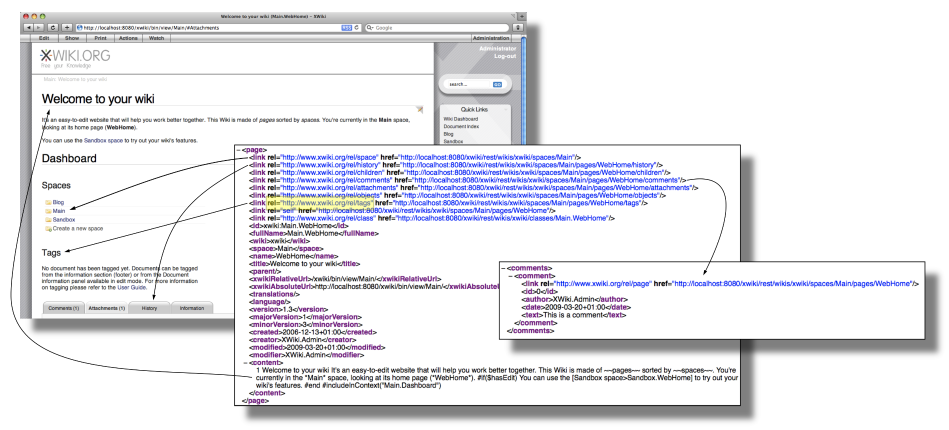

# Main index 

[Sub folder two / Sub sub folder ](/myroot/sub-folder-two/sub-sub-folder)  
[Sub folder two / Index ](/myroot/sub-folder-two/index.md)  
[Sub folder three / Bar](/myroot/sub-folder-three/bar.md)  

## Multiple links on the same line
[Foo](/myroot/foo.md) - [Bar](/myroot/bar.md)  

## External links
[Wikipedia](https://en.wikipedia.org)

